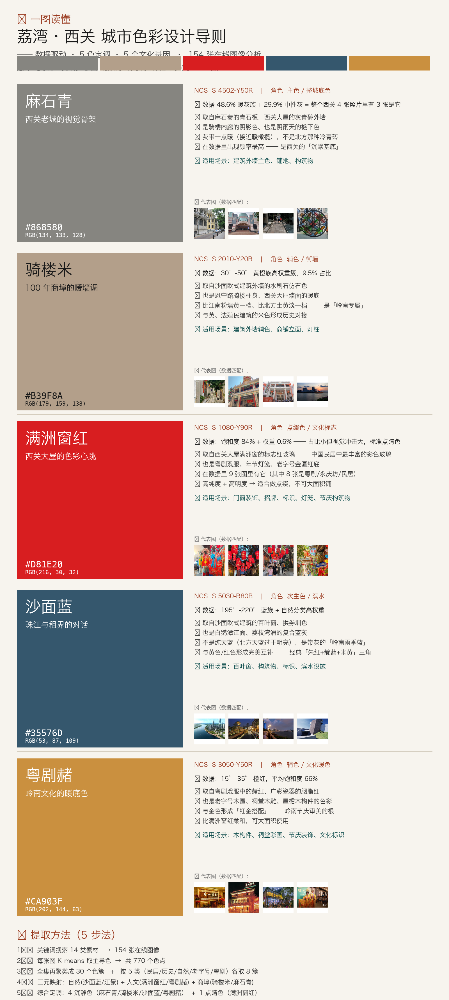

# 城市色彩提取研究 | City Color Extraction Research

> 从城市中提取特征色卡与设计导则的方法论研究与实践

[](https://thoesc086-byte.github.io/city-color-research/)

---

## 🎨 荔湾西关 - 五色色卡

**广州荔湾西关历史文化片区色彩设计导则**



### 五色定义

| 色名 | 色值 | 来源 | 意象 |
|------|------|------|------|
| 🟦 **麻石青** | `#6B7C7D` | 麻石街巷、沙面建筑 | 沉静、历史感 |
| 🟨 **骑楼米** | `#D4C4B0` | 骑楼外墙、老字号招牌 | 温暖、市井气 |
| 🟦 **沙面蓝** | `#8AACBC` | 珠江、荔枝湾涌 | 清新、水乡气质 |
| 🟥 **满洲窗红** | `#C74B50` | 满洲窗花格、粤剧戏服 | 点睛、文化符号 |
| 🟧 **粤剧赭** | `#B85C3E` | 粤剧妆容、老酒坊 | 传统、底蕴 |

---

## 📊 方法论

### 三元映射模型

```
自然基因（生态色） → 直接采样
   ↓
人文基因（历史色） → 文化转译（意象 → 物质载体 → 颜色）
   ↓
产业基因（产业色） → 意象提炼
   ↓
综合定调（5色，4沉静 + 1点睛）
```

### 5步工作流

1. **资料收集** - 自然/人文/产业/现状/上位规划
2. **现状采集** - 实地或远程图片库
3. **色彩聚类** - K-means 取主导色
4. **三元映射** - 自然直采、人文转译、产业提炼
5. **综合定调** - 输出5色色卡（NCS/HEX）+ 导则

参考国标：**GB/T 42648-2023《城市色彩设计指南》**

---

## 📁 项目结构

```
output/city-color/
├── README.md                    # 项目总览
├── 方法论整理.md                # 完整方法论文档
├── 广州11区三生三态分析.md      # 候选区域全景分析
├── 广州候选评估.md              # 西关/黄埔/琶洲详评
├── liwan/                       # 荔湾西关完整案例
│   ├── 1_research/              # 资料收集
│   ├── 2_images/                # 素材图片（历史/民居/自然/粤剧/老字号）
│   ├── 3_color_data/            # 色彩聚类数据
│   ├── 4_outputs/               # 5色色卡 JSON + PNG
│   ├── scripts/                 # Python 提取脚本
│   └── 交付/                    # 最终交付物
│       ├── 色卡/                # 色卡图示
│       ├── 报告/                # 设计导则文本
│       ├── 素材精选/            # 按色分类的代表图片
│       └── web/                 # 🌐 在线展示页面
│           └── index.html       # 📍 主展示页
└── yizhuang-5colors.png         # 参考案例：北京亦庄
```

---

## 🎯 候选区域

| 候选 | 范围 | 类型 | 推荐度 | 状态 |
|------|------|------|--------|------|
| 🥇 **荔湾·西关历史文化片区** | 12 km² | 老城历史 | ⭐️⭐️⭐️⭐️⭐️ | ✅ 已完成 |
| 🥈 **黄埔·中新知识城** | 232 km² | 产业新城 | ⭐️⭐️⭐️⭐️⭐️ | 📋 待研究 |
| 🥉 **海珠·琶洲** | 15 km² | 数字商务 | ⭐️⭐️⭐️⭐️ | 📋 待研究 |

---

## 🌐 在线展示

**👉 [点击查看荔湾西关色卡展示页面](https://thoesc086-byte.github.io/city-color-research/)**

展示内容：
- 5色色卡与色值
- 代表性素材图片
- 色彩来源与设计理念
- 交互式浏览体验

---

## 🛠️ 技术栈

- **色彩提取**: Python + PIL + scikit-learn (K-means)
- **数据分析**: JSON + Markdown
- **可视化**: HTML5 + CSS3 + JavaScript
- **设计工具**: Figma (色卡设计)

---

## 📖 使用说明

### 1. 克隆仓库

```bash
git clone https://github.com/thoesc086-byte/city-color-research.git
cd city-color-research
```

### 2. 本地预览展示页面

```bash
# macOS/Linux
open output/city-color/liwan/交付/web/index.html

# Windows
start output/city-color/liwan/交付/web/index.html
```

### 3. 运行色彩提取脚本

```bash
cd output/city-color/liwan/scripts
python extract_colors.py     # 从图片提取色彩
python define_5colors.py     # 人工定义5色
python match_representatives.py  # 匹配代表图片
```

---

## 📝 参考文献

- GB/T 42648-2023《城市色彩设计指南》
- 《北京亦庄新城城市色彩设计导则》
- 《广州市城市色彩规划（2020-2035）》

---

## 📄 许可

本项目基于研究和学习目的，图片素材来源于公开网络，如有版权问题请联系删除。

---

## 👤 作者

**thoesc086-byte**

- GitHub: [@thoesc086-byte](https://github.com/thoesc086-byte)
- Email: thoesc086@gmail.com

---

## 🙏 致谢

感谢 OpenClaw AI 在研究过程中提供的技术支持。
